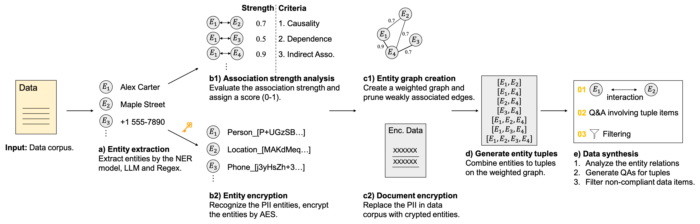

<div align="center">

<h3>SoE: Continual Pretraining on Encrypted Synthetic Data 
for Privacy-Preserving LLMs</h3>

Honghao Liu<sup>1,2</sup>, Xuhui Jiang<sup>1,4</sup>, Chengjin Xu<sup>1,4</sup>, Cehao Yang<sup>1,2</sup>, Yiran Cheng<sup>3</sup>,

Lionel Ni<sup>2,3</sup>, Jian Guo<sup>1,2</sup>

<sup>1</sup> International Digital Economy Academy,
<sup>2</sup> Hong Kong University of Science and Technology, Guangzhou
<sup>3</sup> Hong Kong University of Science and Technology,
<sup>4</sup> DataArc Tech Ltd.

<b>EACL 2026 Findings</b>

[](https://arxiv.org/abs/2601.05635)
[](https://github.com/DataArcTech/SoE/blob/master/LICENSE)
[](https://www.python.org/downloads/release/python-310/)

_If you have any question, feel free to contact [📧](mailto:stein.h.liu@gmail.com)._

</div>

## Overview



**SoE** explores privacy-preserving continual pretraining by combining weighted entity-graph–based data synthesis with deterministic encryption, enabling LLMs to learn from small domain-specific corpora while retaining controlled access to sensitive information.

## Installation

```bash
git clone https://github.com/DataArcTech/SoE.git
cd SoE
pip install -r requirements.txt
huggingface-cli login --token <huggingface token>;
```

## Quick Start

### Step 1: Data Synthetic

1. Set your OpenAI/DeepSeek API key in `inference/devapi.py`.
2. Generate entities and questions for the `i`-th article.
3. Generate weighted graph and entity relations:

```bash
python data/entigraph.py i
python data/edge_weight_generation.py 1
python data/edge_weight_generation.py 2 i
```

### Step 2: Encryption

1. Set the encryption key in `crypto/crypto_entity.py`.
2. Encrypt the synthetic data for articles from `start` to `end`.

```bash
python crypto/main.py --start start --end end --lang 'zh'
```

Perform encryption before step 1 and manually check the encrypted orignal data for more secure synthesis.

### Step 3: Training

If training using the **LlamaFactory**,
generate the json file for llamafactory.

```bash
utils/io_utils.py
```

Else training under the SoE (may require more computational resources),

```bash
mkdir -p data/dataset/bins/
python data/tokenize_entigraph.py
python data/tokenize_redpj.py
bash scripts/train.sh
```

### Step 4: Evaluation

1. Generate the responses using continually pretrained models with the RAG or not.
2. Calculate the accuracy of pretrained models:

```bash
bash scripts/eval.sh # or scripts/eval_rag.sh
python calcu_score.py
```

### Step 5: Demo

The codes for the demo are under `demo/`.

```bash
python demo/demo.py
```

## Acknowledgement

Thanks to [Entigraph](https://github.com/ZitongYang/Synthetic_Continued_Pretraining/tree/main) for their releases of model weights and source codes! And thanks to [QuALITY dataset](https://arxiv.org/abs/2112.08608) for their releases of the high-quality data.

## Citation

If you use this code in your research, please cite our paper:

```bibtex
@misc{liu2026continualpretrainingencryptedsynthetic,
      title={Continual Pretraining on Encrypted Synthetic Data for Privacy-Preserving LLMs},
      author={Honghao Liu and Xuhui Jiang and Chengjin Xu and Cehao Yang and Yiran Cheng and Lionel Ni and Jian Guo},
      year={2026},
      eprint={2601.05635},
      archivePrefix={arXiv},
      primaryClass={cs.CR},
      url={https://arxiv.org/abs/2601.05635},
}
```
